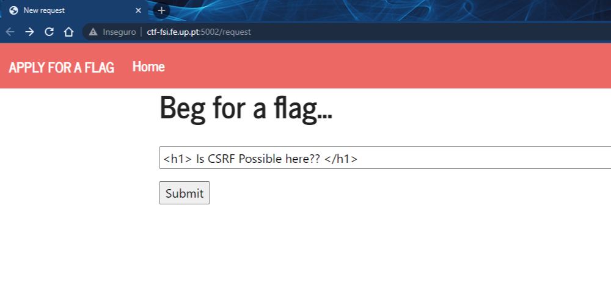
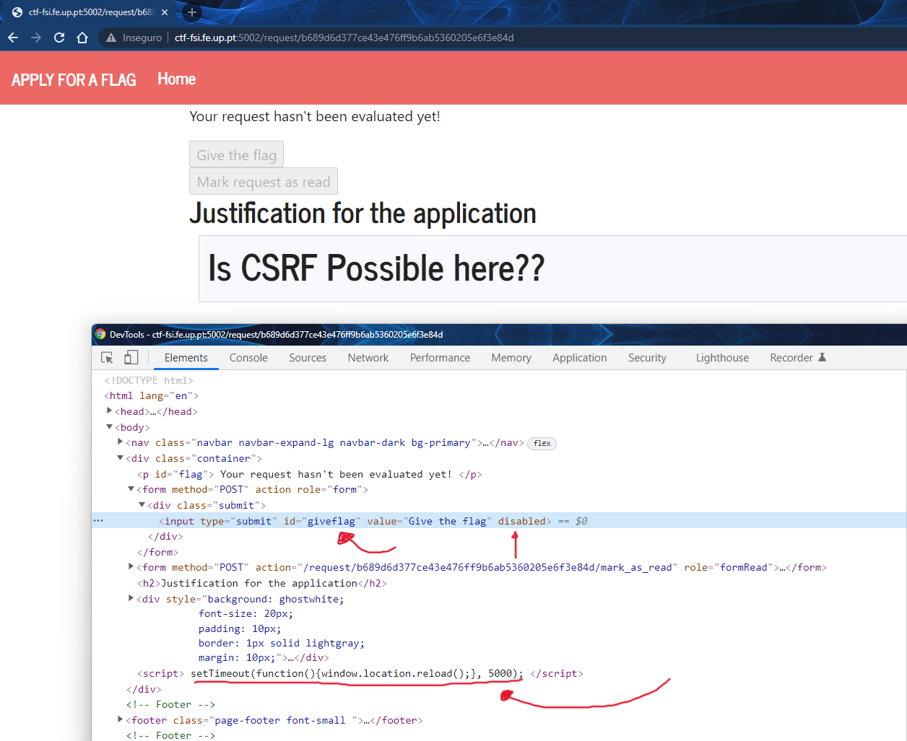
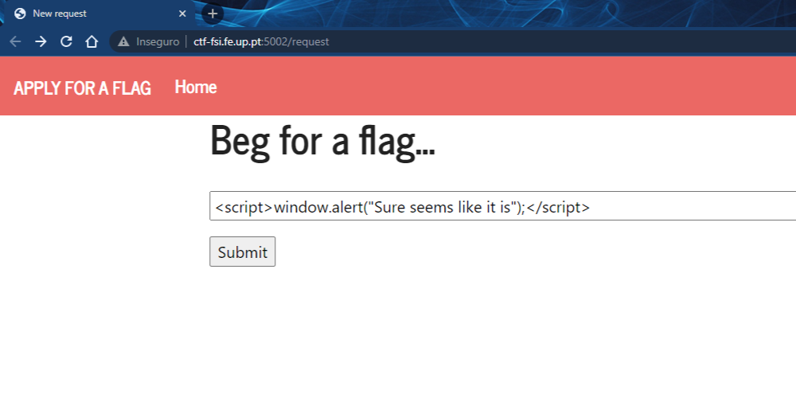
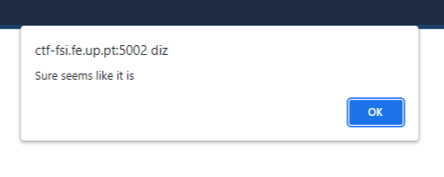
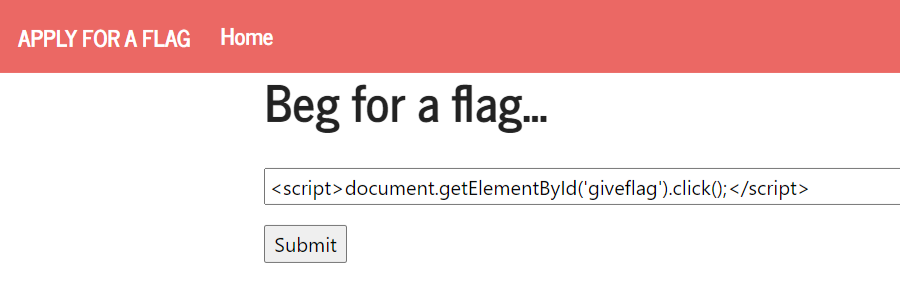

# CTF Semana #10

## Desafio 1

- Começando a explorar o desafio ele aparenta logo algumas semelhanças com ctf da google 'Pasteurize'. Tentamos entao inserir um bloco de HTML para ver como o servidor poderia reagir.



- De facto a tag h1 foi incorporada, o que mais tarde nos levou a tentar scripts.
- Notámos tambem que havia um form que fazia post para obter a flag, no entanto o input estava 'disabled'. Tentamos alterar este valor manualmente mas não funcionava. Para além disso a página executa um script que a cada 5 segundos faz reload da página.



- De seguida tentamos então passar um bloco **script** apenas com a instrução de **window.alert** e o alert foi executado.





- Restava apenas juntar todas estas peças. Como sabemos o id do botão conseguimos obte-lo com **document.getElementById** e forçar um **click()** para obter a flag.



```html
<script>document.getElementById('giveflag').click();</script>
```


