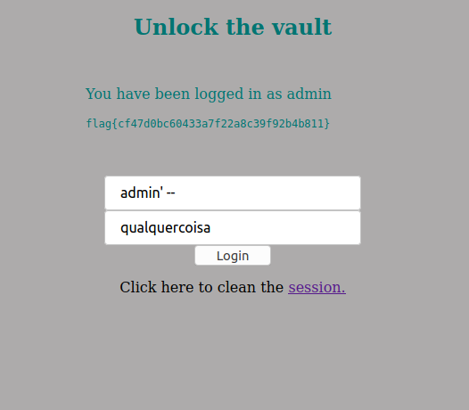
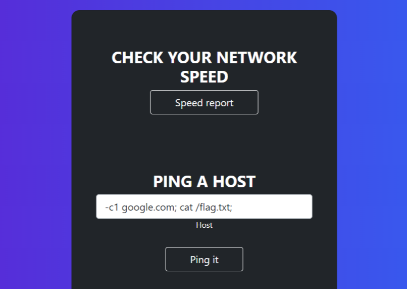
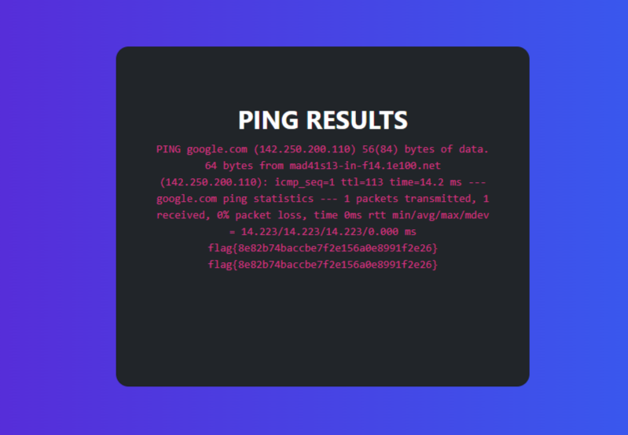

# CTF Semanas #8 & #9

## Desafio 1

- Como sabemos que o objetivo é fazer login na conta de utilizador **'admin'** inserimos a seguinte string no campo de username, onde a plica **( ' )** termina o comando SQL e **( -- )** comenta as linhas seguintes incluindo o controlo de password.

> admin' --

---

## Desafio 2

- Navegando pelo site descobrimos que havia uma ferramenta que podia fazia ping a um servidor. Esta aparenta ter exatamente o mesmo output que o comando 'ping' do Linux, entao é possivel esteja a ser usada a função '**exec**' de php, que executa comandos na SHELL.

- Tentamos entao encadear comandos, com ' cd ', ' ls -l ' , ' find / -name *.txt;" ' e os caracteres ; && || e fomos navegando pelo sistema

- No enunciado era dito que a flag estaria na raiz no ficheiro **/flag.txt** , então bastava fazer cat do mesmo

- Encadeamos esta linha de comandos que nos permitiu obter a flag, pois o servidor não controla o input

- Utilizamos ' **-c1** ' para ter um output um bocado mais simpatico, mas tambem seria posivel usar apenas 'false || cat /flag.txt' e dar bypass ao ping 

