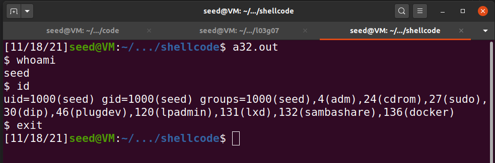
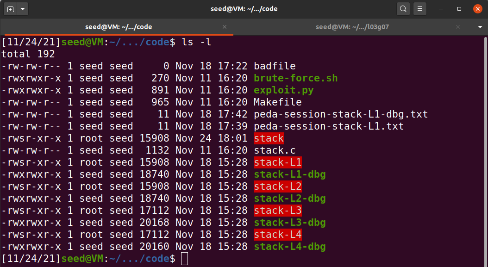

# Trabalho realizado na Semana #5

## Tarefa 1
- Depois de averiguar o codigo utilizamos o makefile disponivel para compilar o programa

```c
[11/18/21]seed@VM:~/.../shellcode$ cat Makefile 

all: 
	gcc -m32 -z execstack -o a32.out call_shellcode.c
	gcc -z execstack -o a64.out call_shellcode.c

setuid:
	gcc -m32 -z execstack -o a32.out call_shellcode.c
	gcc -z execstack -o a64.out call_shellcode.c
	sudo chown root a32.out a64.out
	sudo chmod 4755 a32.out a64.out

clean:
	rm -f a32.out a64.out *.o
```

- Executando o programa nao aparentamos ter permissoes de root, no entanto abriu-se uma shell

  

- Tambem podemos correr no **gdb** o comando: 
> disassemble main

## Tarefa 2

- Mais uma vez utilizamos o makefile para compilar

 

- Conseguimos notar que os ficheiros criados (a vermelho) para alem de terem como dono **root** tem mais permissoes como **x** e **s** (**"setuid" bit**, que diz ao sistema operativo para executar o programa com o userid do seu dono)


## Tarefa 3

```c
20	    strcpy(buffer, str);       
gdb-peda$ p $ebp
$1 = (void *) 0xffffca88
gdb-peda$ p &buffer
$2 = (char (*)[100]) 0xffffca1c

gdb-peda$ p/d 0xffffca88 - 0xffffca1c
$1 = 108


```