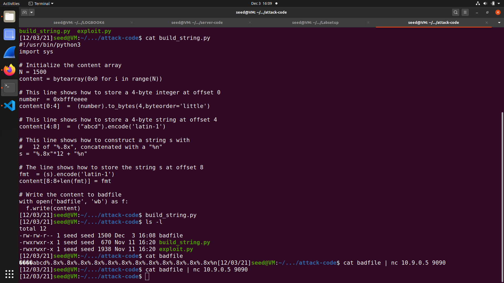
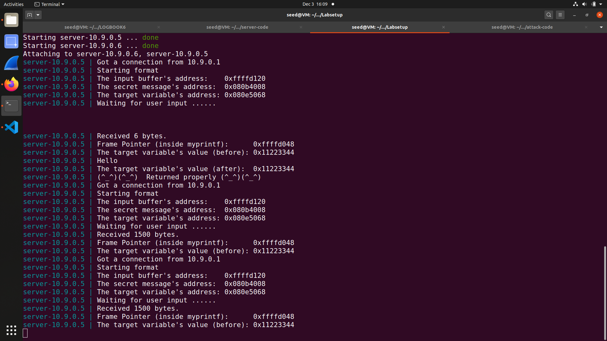

# Trabalho realizado na Semana #6  - Format_String

## Tarefa 1



  

- Para dar crash ao programa fornecemos uma string de **%s** como input:
  ```
  %s%s%s%s
  ```

 - O **%s** trata o valor obtido de um local como um endereço e imprime os dados armazenados nesse endereço .Como a memória armazenada não era para a função de impressão ,pode não conter endereços em todos os locais referenciados levando ao crash do programa.

## Tarefa 2

